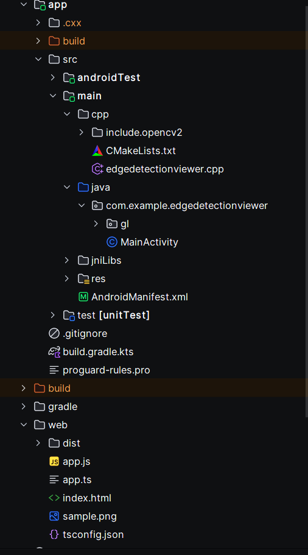
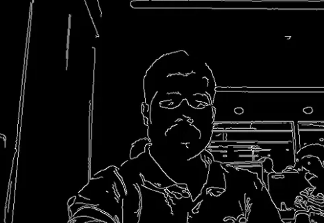
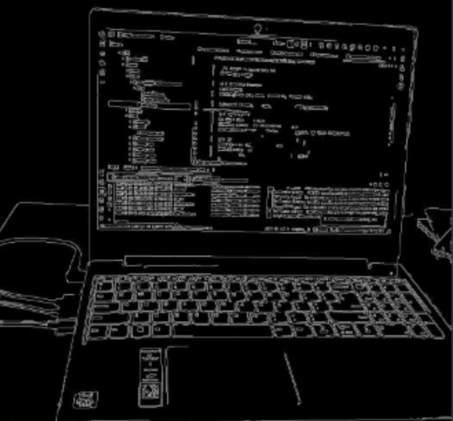

# 📸 Edge Detection Viewer

Edge Detection Viewer is a two-part project built to demonstrate **real-time image processing**, **native C++ OpenCV pipeline**, and a lightweight **web-based PNG viewer**.

This project contains:

1. **Android Application**  
   - Captures live camera frames  
   - Processes them natively using OpenCV (Canny edge detection)  
   - Renders results using OpenGL ES 2.0 textured quad  

2. **Web Application**  
   - Simple PNG viewer built using HTML + TypeScript  
   - Allows selecting and previewing PNG images inside a canvas  

---

## ⭐ Table of Contents

- [Features](#features)
- [Technologies Used](#technologies-used)
- [Project Structure](#project-structure)
- [Android App Setup](#android-app-setup)
- [Web App Setup](#web-app-setup)
- [Screenshots](#screenshots)
- [Architecture Overview](#Architecture-Overview)

---

# ✨ Features

## 📱 Android App
- Real-time camera preview (Camera2 API)
- YUV_420_888 frame extraction
- Correct Y-plane extraction with row + pixel stride support
- Native C++ processing using OpenCV **Canny edge detection**
- Rotation fix for correct device orientation
- OpenGL ES **full-screen textured quad** renderer
- Smooth and efficient real-time visualization

## 🌐 Web App
- PNG upload from user device
- Render image on HTML canvas
- Zero backend required
- Runs on simple static HTTP server

---

# ⚙️ Technologies Used

## Android
- Java
- OpenGL ES 2.0
- Camera2 API
- Native C++
- OpenCV (header-only include)
- JNI + NDK + CMake

## Web
- HTML
- CSS
- TypeScript
- Node.js (http-server)
- Browser Canvas API

---

# 🗂️ Project Structure



---

# 📱 Android App Setup

## 🚀 Steps to Run

### 1. Clone the repository

```bash
git clone https://github.com/smartswagvivek/Real-Time_Edge_Detection.git
cd Real-Time_Edge_Detection
```

### 2. Open project in Android Studio

The IDE will sync Gradle + configure CMake automatically.

---

### 3. Install Android SDK Build-Tools, NDK (Side by side) and CMake

Open:

**Android Studio → Settings → SDK Manager → SDK Tools**

Enable:
* **Android SDK Build-Tools
* **NDK (Side by side)**
* **CMake**

---

### 4. Add OpenCV Headers (Optional)


👉 **Note:** Headers already included, you do **not** need to download OpenCV.
**You can skip this step.**

---

If you are interested in understanding the OpenCV setup, you may follow the detailed instructions below.

1. Download OpenCV Android SDK from:
   [https://opencv.org/releases/](https://opencv.org/releases/)

2. Extract it and copy:

```
OpenCV-android-sdk/sdk/native/jni/include/opencv2/
```

3. Paste the folder into your project at:

```
app/src/main/cpp/include.opencv2/opencv2/
```

The `CMakeLists.txt` is already configured to include this directory.
No further linking is required.

---

### 5. CMake Configuration

CMake automatically builds the native library when you press **Run ▶**.

The file:

```
app/src/main/cpp/CMakeLists.txt
```

is already set up with:

* JNI bindings
* OpenCV include paths
* Shared library output

Nothing extra needs to be changed.

---

### 6. Device Requirements

The Android app uses:

* **Camera2 API**
* **YUV_420_888 frames**

This requires a **physical device**.

Enable:

* Developer options
* USB debugging

---

### 7. Press **Run ▶**

Android Studio will build the C++ code, install the APK, and launch the application.

---

## 🎯 Expected Output

* Live camera preview
* Edge-detected frame (white edges on black background)
* Correct orientation
* Smooth OpenGL rendering

---

# 🌐 Web App Setup

## Requirements

* Node.js (LTS)
* TypeScript compiler (npx tsc)
* `http-server` (auto installed by `npx http-server`)

## Steps

### 1. Navigate to web folder

```bash
cd EdgeDetectionViewer/web
```
### 2. Compile TypeScript
```bash
npx tsc
```

Output file will appear:

```
web/dist/app.js
```

### 3. Start local server

```bash
npx http-server .
```

### 4. Visit in browser

```
http://127.0.0.1:8081
```

### ℹ️ Note about network IP

```
http://192.168.x.x:8081
```

This works **only if**:

* Your laptop & device are on the same Wi-Fi
* Firewall rules allow connections
* Browser allows fetching local server resources

---

## 🖼️ Screenshots

### Android Output



### Web Output


---

# 🧩 Architecture Overview

## 📱 Android (Camera → JNI → OpenCV → OpenGL)

* Camera2 provides **YUV_420_888** frames.
* Java extracts the **Y-plane** and sends it to C++ using **JNI**.
* C++ uses **OpenCV** to run **Canny edge detection**.
* The processed edge buffer is returned to Java via JNI.
* A minimal **OpenGL ES 2.0 renderer** draws the result as a full-screen textured quad.

**Flow:**
`Camera → Y-plane → JNI → OpenCV (C++) → JNI → OpenGL → Screen`

---

## 🌐 Web (HTML + TypeScript)

* User selects a PNG file in the browser.
* **TypeScript** uses `FileReader` to load the image.
* The PNG is drawn onto an HTML **canvas** (2D context).
* Fully static — no backend required.

**Flow:**
`PNG Input → TypeScript → Canvas API → Screen`


---


